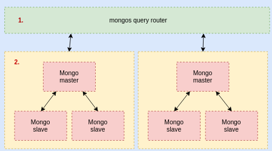

# Sharded mongo on kubernetes

This repo serves as an example of how to shard and load balance various mongo containers.

## Running the scripts

In the "scripts" folder edit "config.sh" and enter your desired values.

After that on a Linux (/mac?) machine execute the following commands:

1. `cd scripts`
2. `bash generate.sh`
3. now just wait untill all is live :)

Given a value of 2 this will leave you with the following architecture:

* 1 mongos query router to route to different shards
* 2 sharded [replicasets](https://docs.mongodb.com/manual/tutorial/deploy-replica-set/) with:  
  * 1 master node
  * 2 slave nodes

Which would look something like this:
